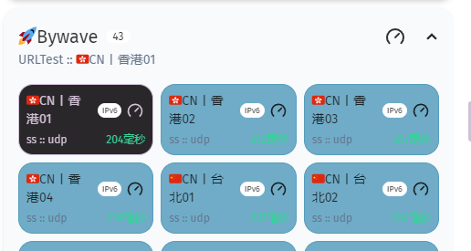

# sub2clash

将订阅链接转换为 Clash、Clash.Meta 配置

## 特性

- 开箱即用的规则、策略组配置
- 自动根据节点名称按国家划分策略组
- 支持多订阅合并
- 支持多种协议
    - Shadowsocks
    - ShadowsocksR
    - Vmess
    - Vless
    - Trojan

## 使用

### 运行

- [docker compose](./docker-compose.yml)
- 运行[二进制文件](https://github.com/nitezs/sub2clash/releases/latest)

### 配置

可以通过编辑 .env 文件来修改默认配置，docker 直接添加环境变量

| 变量名                   | 说明                                                        | 默认值                   |
|-----------------------|-----------------------------------------------------------|-----------------------|
| PORT                  | 端口                                                        | `8011`                |
| META_TEMPLATE         | meta 模板文件名                                                | `template_meta.yaml`  |
| CLASH_TEMPLATE        | clash 模板文件名                                               | `template_clash.yaml` |
| REQUEST_RETRY_TIMES   | Get 请求重试次数                                                | `3`                   |
| REQUEST_MAX_FILE_SIZE | Get 请求订阅文件最大大小（byte）                                      | `1048576`             |
| CACHE_EXPIRE          | 订阅缓存时间（秒）                                                 | `300`                 |
| LOG_LEVEL             | 日志等级，可选值 `debug`,`info`,`warn`,`error`                    | `info`                |
| SHORT_LINK_LENGTH     | 短链长度                                                      | `6`                   |

### API                                       

[API文档](./API_README.md)

### 模板

通过自定义查询语法(类mongodb)自动添加自动测速策略组和策略组相互引用

##### 例如
```yaml
proxy-groups:
  - name: 🌐默认翻墙
    type: select
    proxies:
      - <🚀Bywave:{"SubTags":{"$elemMatch":{"$eq":"Bywave"}}}>
```
- 表示名称为🚀Bywave的策略组
- 筛选条件为SubTags参数数组中有等于Bywave的节点集合生成一个新的自动测速策略组
- 将🚀Bywave的策略组添加到🌐默认翻墙策略组中
- 案例：
  - 
  - 
- 目前查询语法支持：
  - 属性：'SubTags', 'Name', 'Country'
  - 语法：'$elemMatch', '$eq', '$regex', '$not', '$or', '$and'
- 具体案例请移步模板文件

#### 默认模板

- [Clash](./templates/template_clash.yaml)
- [Clash.Meta](./templates/template_meta.yaml)

## 已知问题

[代理链接解析](./parser)还没有经过严格测试，可能会出现解析错误的情况，如果出现问题请提交 issue
